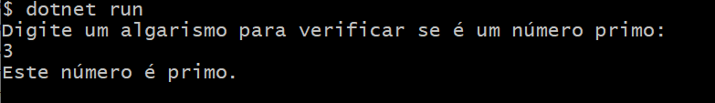
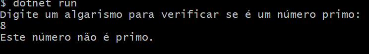
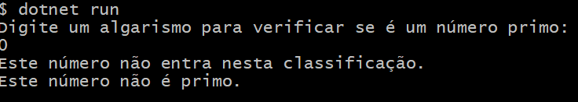
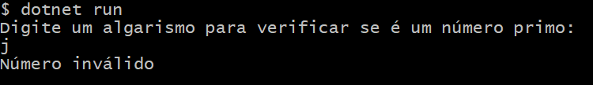

# ParaMeuCurriculo

### Números primos

- ## O que foi utilizado:
  Linguagem de programação: C#
  Ambiente de desenvolvimento: Virtual Studio Code
  
- ## Etapas implementadas:
  1. Entrada de informação:
   - O programa pede que o usuário informe um número para verificar se ele é classificado primo ou não
  2. Verificação:
   - O programa utiliza o Try.Parse para verificar se é um número inteiro válido
  3. Verificação da condição:
   - O programa verifica se o número é menor que 2, pois números menores que 2 não são caracterizados como primos
   - Agora o programa verifica se o número se dividido por 2 é igual a 0, se for igual ele não será primo
   - Se por acaso o número não se encaixar em nenhuma dessas condições, ele será primo
  4. Mensagem de erro:
   - O programa fornecerá uma mensagem de acordo com a entrada
       
- ## Backlog:
 ## futuras adições
  
  implementar a funcionalidade para que o programa crie ou atualize um arquivo .txt onde o resultado do cálculo seja salvo.

  Permitir a entrada de vários números e retornar quais são primos.
     

- ### Conclusão:
  O programa fornece uma base para verificar se um número é primo. Embora a verificação esteja implementada para o número 2, há espaço para melhorias na lógica de verificação de primalidade e na experiência do usuário. O código pode ser expandido para fornecer uma verificação mais completa e uma interface mais amigável.
